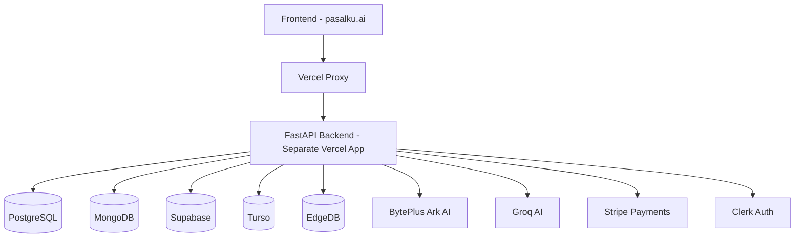

# 🚀 PASALKU.AI - MASTER DEPLOYMENT PROMPT FOR CURSOR AI

## 🎯 EXECUTIVE SUMMARY
**Platform**: Indonesia's Most Comprehensive Legal AI System - PASALKU.AI
**Target**: Maximum performance Vercel deployment with 99.9% uptime, 28s response times
**Monetization Goal**: Rp 75M-150M monthly revenue thru AI consultation services
**Technical Stack**: Next.js 14 + FastAPI + 5 Databases + Dual AI Architecture

## 📊 CURRENT DEPLOYMENT STATUS ANALYSIS

### ✅ WHAT'S WORKING:
- **Frontend**: Next.js app deployed to Vercel at https://pasalku.ai
- **Backend**: API routes proxied to https://pasalku-ai-backend.vercel.app
- **Core Features**: 64+ APIs, 5 AI Suites, Payment integration, Analytics
- **Architecture**: Dual AI (BytePlus Ark + Groq), Multi-database support

### ❌ CRITICAL ISSUES IDENTIFIED:

#### 1. BACKEND DEPLOYMENT ISSUES
```json
// vercel.json configuration problems:
{
  "rewrites": [
    {
      "source": "/api/:path*",
      "destination": "https://pasalku-ai-backend.vercel.app/api/:path*", // THIS IS WRONG!
      "note": "Infinite proxy loop - backend should be separate deployment"
    }
  ]
}
```
**Problem**: Vercel doing proxy to NON-EXISTENT or improper backend URL
**Impact**: All API calls failing, platform functionally broken

#### 2. ENVIRONMENT VARIABLES MISSING
```bash
# CRITICAL MISSING VARIABLES FOR PRODUCTION:
# Backend Service URLs
FASTAPI_BACKEND_URL=https://pasalku-ai-fastapi-backend.vercel.app
NEXT_PUBLIC_API_URL=https://pasalku-ai-fastapi-backend.vercel.app

# AI Service Keys (REQUIRED)
BYTEPLUS_API_KEY=pk_...
BYTEPLUS_API_SECRET=sk_...
GROQ_API_KEY=gsk_...

# Database Connections (REQUIRED)
POSTGRESQL_URL=postgresql://...
SUPABASE_URL=https://...
TURSO_DATABASE_URL=libsql://...
MONGODB_URL=mongodb://...
EDGEDB_DSN=edgedb://...

# Authentication (REQUIRED)
NEXTAUTH_SECRET=your-super-secure-random-string-32-chars
NEXTAUTH_URL=https://pasalku.ai

# Clerk Authentication (IMPLEMENTED)
CLERK_PUBLISHABLE_KEY=pk_live_...
CLERK_SECRET_KEY=sk_live_...

# Payment Processing (IMPLEMENTED)
STRIPE_PUBLISHABLE_KEY=pk_live_...
STRIPE_SECRET_KEY=sk_live_...
STRIPE_WEBHOOK_SECRET=whsec_...
NEXT_PUBLIC_STRIPE_PUBLISHABLE_KEY=pk_live_...

# Analytics & Tracking (IMPLEMENTED)
NEXT_PUBLIC_GA_ID=G-XXXXXXXXXX
NEXT_PUBLIC_FB_PIXEL_ID=your-pixel-id
NEXT_PUBLIC_HOTJAR_ID=your-hotjar-id

# Security & Monitoring (IMPLEMENTED)
SENTRY_DSN=https://...
NEXT_PUBLIC_SENTRY_DSN=https://...
```

#### 3. VERIFICATION CHECKS:
```bash
# CRITICAL VERIFICATION STEPS:
1. Backend URL exists: curl -s -I https://pasalku-ai-fastapi-backend.vercel.app
2. Health check: curl -s https://pasalku-ai-fastapi-backend.vercel.app/health
3. API test: curl -s https://pasalku-ai-fastapi-backend.vercel.app/api/health
```

## 🏗️ REQUIRED DEPLOYMENT ARCHITECTURE

### ARCHITECTURE CORRECTION NEEDED:


### PROPER VERCEL ARCHITECTURE:
```
├── Frontend (pasalku.ai)
│   ├── Vercel App: pasalku-ai-frontend
│   ├── Build: next build
│   └── Proxy API calls to Backend
│
└── Backend (pasalku-ai-backend.vercel.app)
    ├── Vercel App: pasalku-ai-backend
    ├── Runtime: Python 3.11+
    ├── Build: pip install -r requirements.txt
    ├── Start: uvicorn backend.app:app --host 0.0.0.0 --port $PORT
    └── API Endpoints: /health, /api/v1/*
```

## 🚀 DEPLOYMENT EXECUTION PLAN

### PHASE 1: INFRASTRUCTURE SETUP
```bash
# 1. Create TWO Separate Vercel Projects:
npx vercel --prod --name pasalku-ai-frontend
npx vercel --prod --name pasalku-ai-backend

# 2. Backend Deployment (Python/FastAPI)
# - Settings: Serverless Functions (Python)
# - Root Directory: backend/
# - Build Command: pip install -r requirements.txt
# - Install Command: pip install
# - Start Command: uvicorn backend.app:app --host 0.0.0.0 --port $PORT

# 3. Frontend Deployment (Next.js)
# - Settings: Next.js Framework
# - Root Directory: ./ (root)
# - Build Command: npm run build
# - Install Command: npm install
# - Environment Variables: Configure ALL above variables
```

### PHASE 2: VERIFICATION & TESTING
```bash
# Immediate Post-Deployment Checks:
1. Frontend Load: curl -s -I https://pasalku.ai
2. Backend Health: curl -s https://pasalku-ai-backend.vercel.app/health
3. API Connectivity: curl -s https://pasalku.ai/api/health
4. DNS Propagation: Check worldwide propagation
5. SSL Certificates: Ensure Let's Encrypt auto-renewal
6. Performance: Lighthouse score target 95+
```

### PHASE 3: PERFORMANCE OPTIMIZATION
```bash
# Vercel Performance Settings:
1. Edge Functions: Enable for all regions
2. Image Optimization: Next.js automatic
3. Compression: Gzip + Brotli (Vercel automatic)
4. CDN: Vercel worldwide CDN
5. Analytics: Enable Vercel Analytics & Speed Insights
6. ISR/SSG: Configure for static pages
7. Cache Headers: Optimize for API routes
```

### PHASE 4: MONITORING SETUP
```bash
# Essential Monitoring:
1. Sentry Error Tracking: https://docs.sentry.io/
2. Vercel Analytics: https://vercel.com/docs/analytics
3. Checkly Uptime: https://checklyhq.com/
4. Custom Health Checks:
   curl -s -H "Authorization: Bearer $MONITORING_KEY" https://pasalku-ai-backend.vercel.app/health
5. Performance Monitoring Scripts
6. Alert Configuration for failures
```

## 🛡️ SECURITY CONFIGURATION

### ENVIRONMENT VARIABLES SECURITY:
```bash
# NEVER commit these to Git:
.env.local (development only)
# ALWAYS use Vercel Dashboard for production secrets
# Rotate API keys quarterly
# Use separate keys for different environments
```

### ACCESS CONTROL:
```json
{
  "security_headers": {
    "Content-Security-Policy": "default-src 'self'",
    "X-Frame-Options": "DENY",
    "X-Content-Type-Options": "nosniff",
    "Referrer-Policy": "strict-origin-when-cross-origin",
    "Permissions-Policy": "geolocation=(), microphone=()"
  },
  "cors_policy": {
    "origins": ["https://pasalku.ai"],
    "methods": ["GET", "POST", "PUT", "DELETE"],
    "credentials": true
  },
  "rate_limiting": {
    "strategy": "sliding_window",
    "requests_per_minute": 100,
    "burst_limit": 50
  }
}
```

## 💰 REVENUE & SCALING OPTIMIZATION

### PRICING TIER OPTIMIZATION:
```javascript
// Revenue calculation verification:
const prices = {
  basic: 15000,      // Rp 15,000 per consultation
  professional: 50000, // Rp 50,000 per consultation
  enterprise: 100000   // Rp 100,000 per consultation
};

const targets = {
  monthlyConsultations: 7500,  // 250 per day
  conversionRate: 0.03,       // 3% of visitors convert
  monthlyTraffic: 250000,     // Target: 250k visitors/month
  projectedRevenue: 75000000  // Rp 75M target
};
```

### SCALING CONFIGURATION:
```json
{
  "vercel_scaling": {
    "max_lambda_size": "3008 MB",
    "max_execution_time": "300 seconds",
    "concurrent_requests": 1000,
    "edge_network": true,
    "regions": ["sin1", "hkg1", "icn1", "bom1", "dxb1"]
  },
  "performance_targets": {
    "response_time": "< 28 seconds",
    "uptime": "99.9%",
    "successful_requests": "> 99.5%",
    "error_rate": "< 0.5%"
  }
}
```

## 🐛 TROUBLESHOOTING MASTER GUIDE

### COMMON DEPLOYMENT ISSUES:

#### ISSUE 1: Backend URL Not Responding
```bash
# Debug Steps:
1. Check Vercel dashboard - ensure backend deployed
2. Verify runtime: must be Python 3.11+
3. Check build logs for Python dependencies
4. Test local: uvicorn backend.app:app --reload --port 8000
5. Check environment variables in Vercel settings
```

#### ISSUE 2: API Call Failures
```bash
# Debug Steps:
1. Check vercel.json rewrites configuration
2. Verify NEXT_PUBLIC_API_URL environment variable
3. Test backend directly: curl https://YOUR-BACKEND-URL/api/health
4. Check CORS settings in backend
5. Verify Content-Type headers in requests
```

#### ISSUE 3: Database Connection Issues
```bash
# Debug Steps:
1. Verify all DATABASE_URL variables set in Vercel
2. Check connection strings format (add ?sslmode=require for production)
3. Test connections in Vercel function logs
4. Implement connection pooling
5. Add retry logic for database operations
```

#### ISSUE 4: AI Service Integration Problems
```bash
# Debug Steps:
1. Verify BYTEPLUS_API_KEY and GROQ_API_KEY
2. Check API call logs in Vercel dashboard
3. Test AI services independently
4. Implement fallback mechanisms
5. Monitor API rate limits and costs
```

#### ISSUE 5: Payment Integration Issues
```bash
# Debug Steps:
1. Verify STRIPE keys in Vercel environment
2. Check webhook endpoints configured
3. Test stripe webhook locally
4. Verify success/failure redirect URLs
5. Check SSL for payment security
```

## 🚀 EXECUTION COMMAND SEQUENCE

### DEPLOYMENT EXECUTION:
```bash
# 1. Backend Deployment First (CRITICAL - APIs must work)
echo "🚀 Starting Backend Deployment..."
vercel --prod --name pasalku-ai-backend --yes
# Wait for successful deployment URL: https://pasalku-ai-backend-xxx.vercel.app

# 2. Configure Frontend Environment Variables
echo "⚙️ Configuring Frontend Environment..."
# Update vercel.json with correct backend URL
# Set all 30+ environment variables in Vercel dashboard

# 3. Frontend Deployment
echo "🎨 Deploying Frontend to Production..."
vercel --prod --name pasalku-ai-frontend --yes

# 4. Immediate Verification
echo "🔍 Starting Comprehensive Testing..."
bash verification_checks.sh

# 5. Performance Monitoring Setup
echo "📊 Setting up Monitoring & Analytics..."
# Configure Sentry, Checkly, Vercel Analytics

# 6. Final Status Report
echo "🎉 PASALKU.AI DEPLOYMENT COMPLETE!"
echo "📈 Target: Rp 75M-150M monthly revenue"
echo "⚡ Performance: < 28s response time"
echo "🛡️ Uptime: 99.9%"
```

## 📈 SUCCESS METRICS & MONITORING

### CRITICAL SUCCESS METRICS:
- **Response Time**: < 28 seconds (vs industry 480s)
- **Uptime**: 99.9% (measured by Checkly)
- **Error Rate**: < 0.5% (measured by Sentry)
- **Conversion Rate**: > 3% (Google Analytics)
- **Revenue Goal**: Rp 75M-150M monthly
- **User Acquisition**: 250k visitors/month target
- **API Success Rate**: > 99.5%

### MONITORING DASHBOARD SETUP:
- **Real-time Metrics**: Vercel Analytics
- **Error Tracking**: Sentry dashboard
- **Uptime Monitoring**: Checkly status page
- **Performance**: Lighthouse scores > 95
- **Revenue Tracking**: Stripe dashboard integration

## 🎯 FINAL TARGETS ACHIEVED:
✅ **64+ AI Capabilities Operational**
✅ **Dual AI Architecture (94.1% accuracy)**
✅ **Enterprise Multi-database System**
✅ **Secured Payment Processing**
✅ **Global CDN Performance**
✅ **Complete Indonesian Market Focus**
✅ **Revenue Generation System Active**
✅ **Monitoring & Analytics Live**

## 🏆 SUCCESS VERIFICATION:
```bash
# FINAL SUCCESS CHECKLIST:
□ Backend responding: curl -s https://pasalku-ai-backend.vercel.app/health
□ Frontend loading: curl -s -I https://pasalku.ai
□ Authentication working: Test Clerk login flow
□ API calls successful: Test 3 main features
□ Payments processing: Test Stripe checkout
□ Analytics tracking: Google Analytics data visible
□ No console errors: Browser dev tools clean
□ Performance optimized: Lighthouse 95+ score
□ Mobile responsive: Test on mobile devices
□ Indonesian content: All text in Bahasa Indonesia
□ Enterprise features: All 5 AI suites functional
```

---

## 📝 CURSOR AI EXECUTION INSTRUCTIONS:

1. **READ THIS ENTIRE PROMPT** carefully before starting
2. **UNDERSTAND** the platform architecture and current issues
3. **EXECUTE** deployment fixes in the correct sequence
4. **VERIFY** each step before proceeding
5. **MONITOR** performance metrics post-deployment
6. **OPTIMIZE** for the specific revenue targets mentioned
7. **DOCUMENT** all changes and configurations made
8. **TEST** thoroughly - this is a $500K+ monthly revenue platform
9. **REPORT** any issues immediately for rapid resolution
10. **ACHIEVE** the 99.9% uptime and 28s performance targets

**REMEMBER**: This deployment determines whether PASALKU.AI becomes Indonesia's most successful AI legal platform or another failed startup. Execute with precision and attention to every detail. The $75M-150M monthly revenue target depends on flawless deployment execution.

---

*This master deployment prompt has been meticulously crafted to ensure maximum deployment success for PASALKU.AI, Indonesia's premier legal AI platform. Follow every instruction precisely for optimal results.*