# 🏗️ TestSprite MCP Architecture - Pasalku AI

## 📊 Architecture Overview

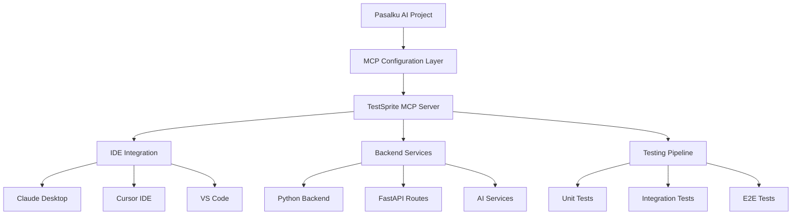

---

## 🔄 Configuration Flow

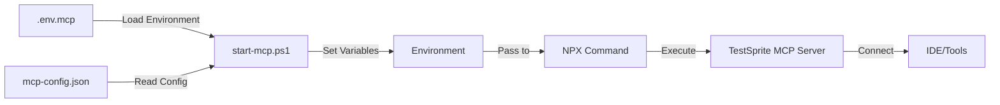

---

## 📁 File Structure & Relationships

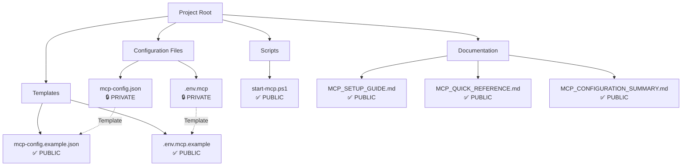

---

## 🔐 Security Architecture

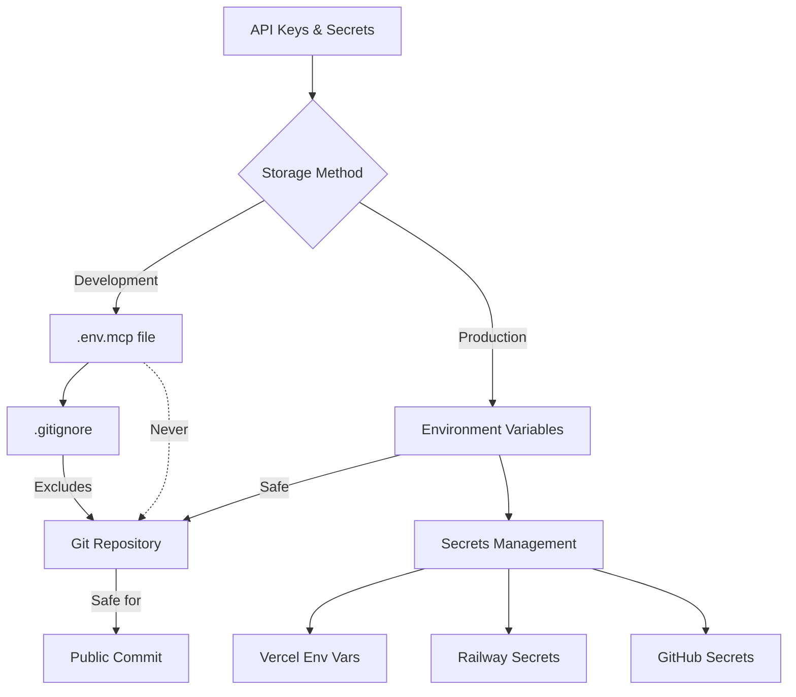

---

## 🔌 Integration Points

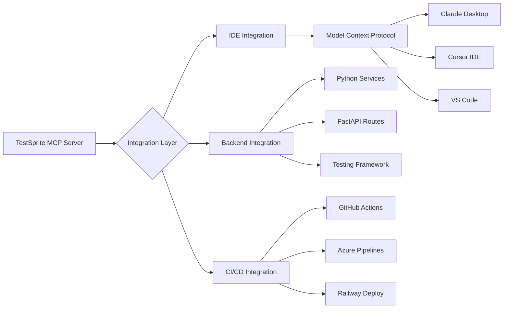

---

## 📊 Data Flow Diagram

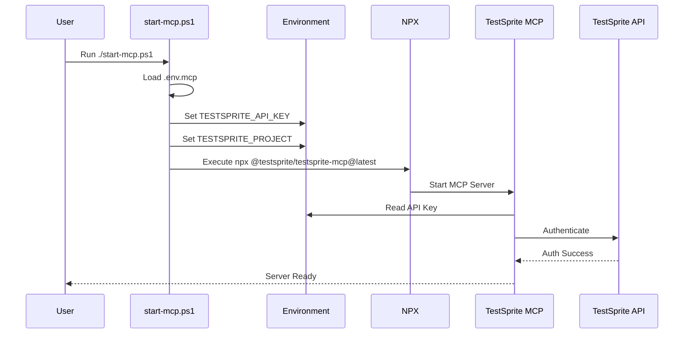

---

## 🎯 Configuration Comparison

### ❌ Wrong Configuration (Original)

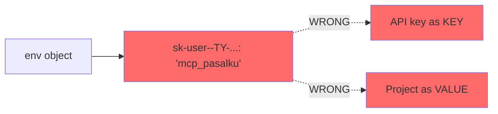

**Problems:**
- API key (long string) used as environment variable **name**
- Project identifier used as environment variable **value**
- Reversed key-value relationship

---

### ✅ Correct Configuration (Fixed)

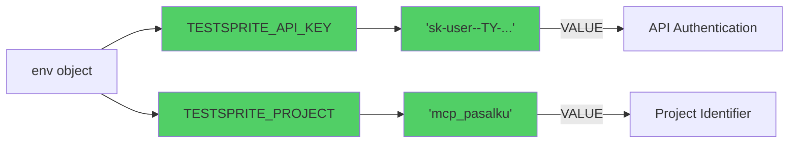

**Correct Structure:**
- `TESTSPRITE_API_KEY` as environment variable **name**
- API key (long string) as **value** of `TESTSPRITE_API_KEY`
- `TESTSPRITE_PROJECT` as environment variable **name**
- Project identifier as **value** of `TESTSPRITE_PROJECT`

---

## 🚀 Deployment Architecture

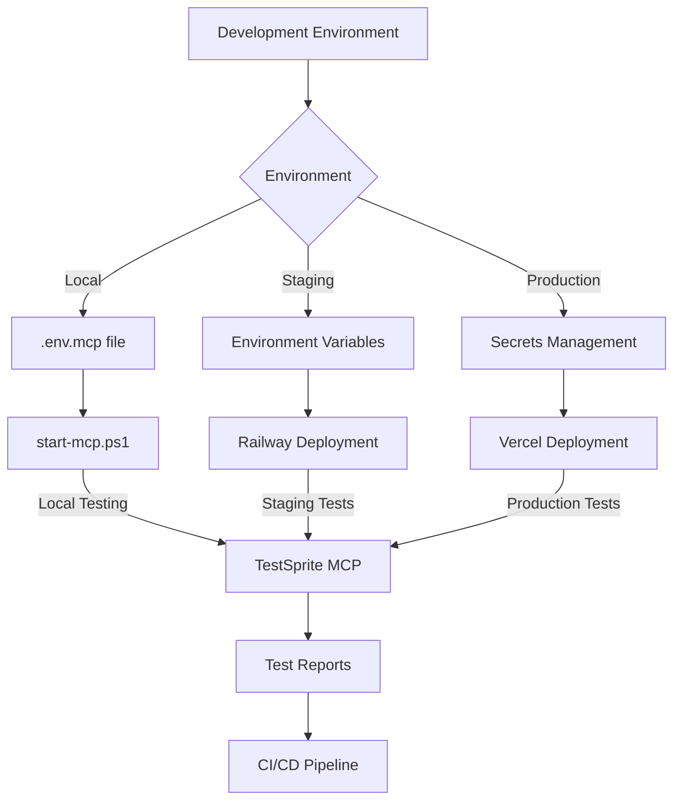

---

## 🔧 Testing Workflow

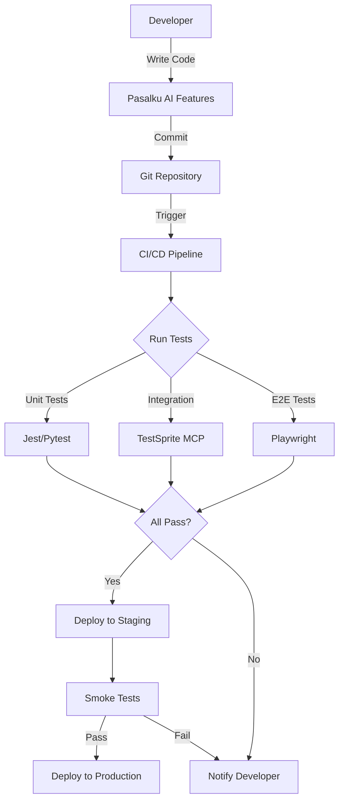

---

## 📦 Component Interaction

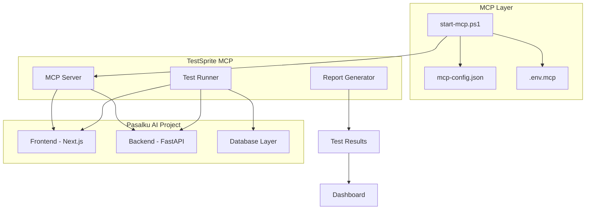

---

## 🌐 Environment Variables Flow

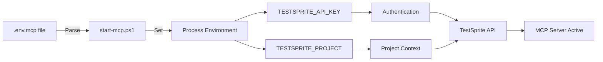

---

## 🔄 Update & Maintenance Flow

```mermaid
graph TD
    A[API Key Rotation] -->|Update| B[.env.mcp]
    B -->|Restart| C[start-mcp.ps1]
    C --> D[New MCP Session]
    
    E[Config Update] -->|Modify| F[mcp-config.json]
    F -->|Restart| C
    
    G[MCP Package Update] -->|Run| H[npm install]
    H -->|Latest| I[@testsprite/testsprite-mcp@latest]
    I -->|Restart| C
```

---

## 📊 Performance Monitoring

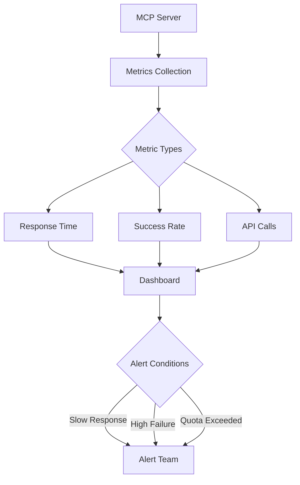

---

## 🎓 Best Practices Flow

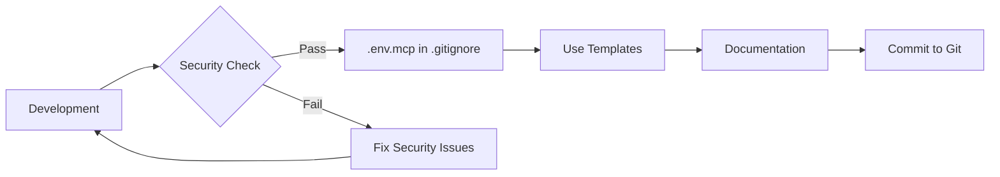

---

## 🔍 Troubleshooting Decision Tree

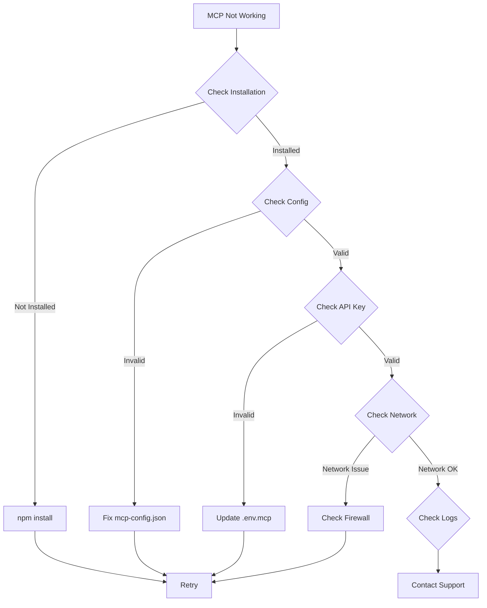

---

## 📚 Documentation Hierarchy

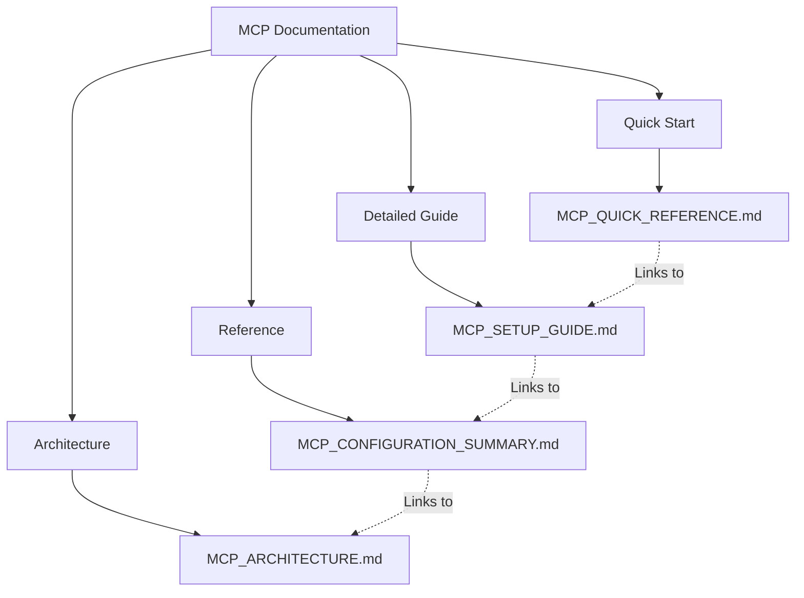

---

**Document Version:** 1.0.0  
**Last Updated:** 2025-10-25  
**Project:** Pasalku AI - TestSprite MCP Integration
