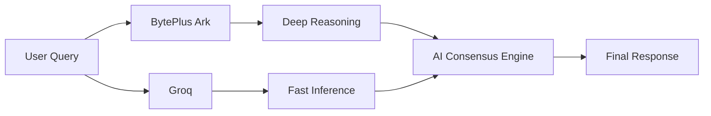
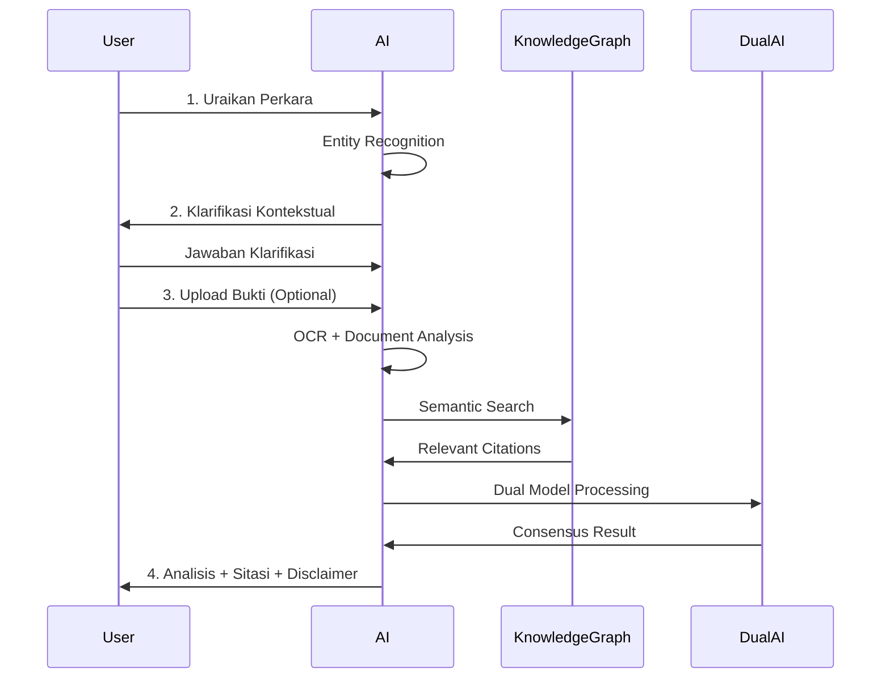

# PETA KONSEP: TUJUAN AWAL & KONSEP DASAR AI PASALKU.AI

> **Versi:** 1.0  
> **Tanggal:** 15 Oktober 2025  
> **Status:** Living Document

---

## 📋 Daftar Isi

- [I. Visi & Tujuan Awal](#i-visi--tujuan-awal-pasalkuai)
- [II. Konsep Dasar AI](#ii-konsep-dasar-ai-pasalkuai)
- [III. Peta Implementasi](#iii-peta-implementasi)
- [IV. Roadmap Diskusi](#iv-roadmap-diskusi)

---

## I. Visi & Tujuan Awal Pasalku.ai

### 🎯 Tujuan Utama

**Mendemokratisasi akses terhadap informasi dan konsultasi hukum yang akurat dan terpercaya bagi masyarakat Indonesia.**

### 🚀 Misi

1. **Memberikan Kejelasan Hukum**
   - Mengubah bahasa hukum yang kompleks menjadi informasi yang mudah dipahami
   - Menyajikan penjelasan kontekstual yang relevan dengan situasi pengguna

2. **Efisiensi Akses**
   - Menyediakan solusi konsultasi hukum yang cepat dan tersedia 24/7
   - Mengurangi waktu riset hukum dari hari ke menit

3. **Akurasi & Kredibilitas**
   - Memastikan informasi didukung oleh sumber hukum yang valid (pasal, undang-undang, putusan)
   - Sistem sitasi otomatis yang transparan dan terverifikasi

4. **Inovasi Teknologi**
   - Memanfaatkan AI terdepan untuk merevolusi layanan hukum
   - Menggabungkan multiple AI models untuk hasil optimal

5. **Pemberdayaan Pengguna**
   - Membantu individu dan profesional membuat keputusan hukum yang lebih baik
   - Memberikan pemahaman, bukan hanya jawaban

### 👥 Target Audiens

#### 1. Masyarakat Umum
- **Kebutuhan:** Pemahaman hukum dasar, solusi masalah hukum sehari-hari
- **Use Case:** Sengketa tetangga, kontrak sederhana, hak konsumen

#### 2. Pelaku Usaha Kecil & Menengah (UKM)
- **Kebutuhan:** Panduan kontrak, kepatuhan regulasi, legalitas bisnis
- **Use Case:** Draft perjanjian kerjasama, izin usaha, pajak UKM

#### 3. Praktisi Hukum
- **Kebutuhan:** Asisten riset, analisis dokumen, second opinion
- **Use Case:** Riset yurisprudensi, analisis kontrak kompleks, persiapan kasus

#### 4. Pemerhati Hukum/Mahasiswa
- **Kebutuhan:** Akses cepat ke basis data hukum dan sitasi
- **Use Case:** Penelitian akademis, pemahaman doktrin, studi kasus

### 🎯 Masalah yang Diselesaikan

| Masalah | Solusi Pasalku.ai |
|---------|-------------------|
| Kesulitan memahami jargon hukum | Simplifikasi bahasa dengan AI translator |
| Biaya konsultasi yang mahal | Platform digital dengan pricing terjangkau |
| Akses terbatas ke sumber hukum | Knowledge Graph komprehensif |
| Waktu riset yang lama | Semantic search & AI-powered analysis |
| Analisis dokumen manual | Document Intelligence Engine |

---

## II. Konsep Dasar AI Pasalku.ai

### 🧠 Inti Konsep

**"Asisten Hukum Digital" yang tidak hanya menjawab, tetapi juga memahami, menganalisis, dan menyajikan informasi hukum secara cerdas.**

---

### 1. 🔄 Pendekatan Dual AI Fusion



#### Model Utama 1: BytePlus Ark
- **Fokus:** Pemahaman konteks, penalaran kompleks
- **Keunggulan:** Reasoning chain, analisis multi-layer
- **Use Case:** Draft awal jawaban, struktur argumen hukum

#### Model Utama 2: Groq
- **Fokus:** Kecepatan inferensi, pemrosesan skala besar
- **Keunggulan:** Real-time response, optimasi throughput
- **Use Case:** Refinement jawaban, validasi cepat

#### AI Consensus Mechanism
- **Proses:** Output kedua model dibandingkan dan digabungkan
- **Metrik:** Confidence scoring, semantic similarity
- **Output:** Jawaban paling akurat dan komprehensif

---

### 2. 🗄️ Knowledge Graph Hukum Indonesia (EdgeDB)

#### Pondasi Data

```
📚 Knowledge Base Components:
├── 📖 Peraturan Perundang-undangan
│   ├── UU (Undang-Undang)
│   ├── PP (Peraturan Pemerintah)
│   ├── Perpres (Peraturan Presiden)
│   └── Perda (Peraturan Daerah)
├── ⚖️ Putusan Pengadilan
│   ├── Yurisprudensi
│   ├── Putusan Landmark
│   └── Interpretasi Hakim
├── 📚 Doktrin Hukum
│   ├── Teori Hukum
│   └── Pendapat Ahli
└── 📝 Interpretasi Resmi
    ├── Penjelasan UU
    └── Circular/Surat Edaran
```

#### Relasi Semantik

- **Hierarki:** UU → PP → Perpres → Peraturan Teknis
- **Referensi Silang:** Pasal X UU Y ↔ Pasal A PP B
- **Temporal:** Perubahan/pencabutan aturan
- **Topical:** Clustering berdasarkan bidang hukum

#### Pencarian Cerdas

- **Semantic Search:** Pencarian berdasarkan makna, bukan hanya keyword
- **Context-Aware:** Memahami konteks legal spesifik
- **Citation Tracking:** Automatic citation generation
- **Relevance Ranking:** Prioritas berdasarkan relevansi dan update

---

### 3. 🔄 Alur Pemrosesan Pertanyaan (4 Langkah Integral)



#### Langkah 1: Uraikan Perkara
**Input:** Masalah hukum dalam bahasa natural

**Proses AI:**
- Natural Language Understanding (NLU)
- Entity extraction (pihak, lokasi, waktu, jenis kasus)
- Context classification (pidana, perdata, tata usaha negara, dll.)
- Initial risk assessment

**Output:** Pemahaman awal struktur kasus

---

#### Langkah 2: Jawab Klarifikasi AI
**Input:** Pertanyaan kontekstual dari AI

**Proses AI:**
- Reasoning Chain Analyzer mengidentifikasi celah informasi
- Pertanyaan adaptif berdasarkan jenis kasus
- Progressive disclosure (tidak overload pengguna)

**Output:** Dataset lengkap untuk analisis

**Contoh:**
```
Kasus: "Tetangga saya membangun tembok yang menghalangi jalan saya"

AI Clarification:
1. Apakah jalan tersebut adalah hak milik Anda atau jalan umum?
2. Sudah berapa lama tembok tersebut berdiri?
3. Apakah ada perjanjian tertulis sebelumnya?
4. Sudah pernah melakukan mediasi informal?
```

---

#### Langkah 3: Unggah Bukti Pendukung (Opsional)
**Input:** Dokumen pendukung (PDF, foto, scan)

**Proses AI:**
- **Smart Document Upload:**
  - OCR (Optical Character Recognition)
  - Image enhancement untuk dokumen berkualitas rendah
- **Document Intelligence Engine:**
  - Contract analysis
  - Key clause extraction
  - Risk identification
  - Date & party extraction

**Output:** Structured data dari dokumen tidak terstruktur

---

#### Langkah 4: Terima Analisis Berdasar Hukum
**Input:** Data komprehensif dari langkah 1-3

**Proses AI:**
1. Knowledge Graph semantic search
2. Dual AI processing (BytePlus + Groq)
3. Citation matching & validation
4. Legal reasoning synthesis
5. Multi-option solution generation
6. Risk assessment & disclaimer

**Output Format:**
```markdown
## 📋 Ringkasan Masalah
[Penjelasan singkat kasus]

## ⚖️ Dasar Hukum Relevan
- **Pasal X UU No. Y Tahun Z:** [Isi pasal]
- **Putusan MA No. ABC:** [Ratio decidendi]

## 🔍 Analisis Hukum
[Penerapan hukum pada kasus konkret]

## 💡 Opsi Penyelesaian
1. Opsi A: [Penjelasan + Pro/Kontra]
2. Opsi B: [Penjelasan + Pro/Kontra]

## ⚠️ Catatan Penting
[Risiko, biaya, waktu estimasi]

## 📚 Sitasi Lengkap
[Daftar semua referensi hukum]

---
⚖️ **DISCLAIMER:** Informasi ini bersifat edukatif dan tidak menggantikan konsultasi hukum profesional.
```

---

### 4. 🎯 Fitur AI Pendukung (Holistik)

#### 🎭 Adaptive Persona System
- **Fungsi:** Menyesuaikan gaya komunikasi AI
- **Implementasi:** 
  - Formal untuk analisis kontrak
  - Ramah untuk konsultasi umum
  - Teknis untuk praktisi hukum
- **Future:** Strategi negosiasi adaptif

#### 🧩 Reasoning Chain Analyzer
- **Fungsi:** Deteksi cacat logika dalam argumen hukum
- **Use Case:**
  - Validasi argumentasi pengguna
  - Identifikasi fallacy
  - Strengthening legal reasoning

#### 💭 Sentiment Analysis Engine
- **Fungsi:** Analisis tone dokumen & percakapan
- **Use Case:**
  - Deteksi urgency level
  - Risk assessment from communication tone
  - Emotional intelligence dalam respons

#### 📄 Contract Intelligence Engine
- **Fungsi:** Optimasi kontrak & deteksi risiko
- **Features:**
  - Clause recommendation
  - Unfair term detection
  - Completeness checking
  - Version comparison

#### 💬 AI Legal Chat
- **Fungsi:** Interface konsultasi utama
- **Features:**
  - Context retention
  - Multi-turn conversation
  - History tracking
  - Export conversation

#### 🌐 Language Translator
- **Bahasa:** Indonesia, Inggris, (Bahasa Daerah - future)
- **Capabilities:**
  - Legal term preservation
  - Context-aware translation
  - Bidirectional translation

---

### 5. 🛡️ Prinsip Keamanan & Etika

#### ⚖️ "Depiction is Not Endorsement"
> AI menyediakan informasi, bukan nasihat hukum

**Implementasi:**
- Clear labeling di setiap response
- Explicit disclaimer di akhir sesi
- User acknowledgment required

#### 📚 Sitasi Wajib
> Setiap jawaban hukum harus disertai sitasi yang jelas

**Standard:**
- Pasal + UU + Tahun
- Putusan dengan nomor lengkap
- Sumber doktrin dengan pengarang
- Link ke sumber official (jika tersedia)

#### ⚠️ Disclaimer Akhir
**Template:**
```
⚖️ DISCLAIMER HUKUM

Informasi yang diberikan oleh Pasalku.ai bersifat umum dan edukatif. 
Ini bukan nasihat hukum profesional. Untuk situasi spesifik Anda, 
silakan konsultasikan dengan advokat berlisensi.

Pasalku.ai tidak bertanggung jawab atas keputusan yang diambil 
berdasarkan informasi ini tanpa verifikasi profesional lebih lanjut.

Terakhir diperbarui: [timestamp]
```

#### 🔐 Enkripsi Data
- **In Transit:** TLS 1.3
- **At Rest:** AES-256
- **Database:** EdgeDB encryption
- **Session:** JWT dengan expiry

#### ✅ Verifikasi Profesional
**Ecosystem Building:**
- Partnership dengan law firms
- Lawyer verification badge
- Professional consultation booking
- AI + Human hybrid model

---

## III. Peta Implementasi

### 🏗️ Arsitektur Teknis

```
┌─────────────────────────────────────────────────────┐
│                   FRONTEND (Next.js)                │
│  - Chat Interface  - Document Upload  - Dashboard   │
└────────────────────┬────────────────────────────────┘
                     │
┌────────────────────▼────────────────────────────────┐
│               BACKEND (FastAPI)                     │
│  ┌──────────────┐  ┌──────────────┐                │
│  │ Dual AI Core │  │ Document AI  │                │
│  └──────┬───────┘  └──────┬───────┘                │
│         │                  │                         │
│  ┌──────▼──────────────────▼───────┐               │
│  │    Knowledge Graph Service      │               │
│  └──────────────┬──────────────────┘               │
└─────────────────┼──────────────────────────────────┘
                  │
┌─────────────────▼────────────────────────────────┐
│              DATABASE LAYER                      │
│  ┌─────────────┐  ┌──────────────┐              │
│  │   EdgeDB    │  │   MongoDB    │              │
│  │ (Relations) │  │ (Documents)  │              │
│  └─────────────┘  └──────────────┘              │
└──────────────────────────────────────────────────┘
```

### 📊 Mapping Konsep ke Modul

| Konsep | Backend Module | Database | Status |
|--------|---------------|----------|--------|
| Dual AI Fusion | `services/ai/` | MongoDB (cache) | ✅ Active |
| Knowledge Graph | `services/knowledge_graph/` | EdgeDB | 🔄 Development |
| Document Intelligence | `services/document_ai/` | MongoDB | ✅ Active |
| Chat Interface | `routers/chat.py` | MongoDB | ✅ Active |
| Citation System | `services/citation/` | EdgeDB | 📋 Planned |
| Reasoning Chain | `services/reasoning/` | MongoDB | 📋 Planned |

---

## IV. Roadmap Diskusi

### ✅ Phase 1: Foundation (Completed)
**Focus:** Core functionality & stability

**Key Discussions:**
- [ ] EdgeDB schema design untuk Knowledge Graph
- [ ] Citation system architecture
- [x] Dual AI consensus algorithm
- [ ] Performance optimization

### 🚀 Phase 2: Intelligence (Q1 2026)
**Focus:** Advanced AI features

**Key Discussions:**
- [ ] Reasoning Chain Analyzer implementation
- [ ] Contract Intelligence Engine
- [ ] Adaptive Persona System
- [ ] Multi-language support expansion

### 🌟 Phase 3: Ecosystem (Q2 2026)
**Focus:** Professional integration

**Key Discussions:**
- [ ] Lawyer verification system
- [ ] Professional dashboard
- [ ] API for third-party integration
- [ ] Enterprise features

---

## 📚 Referensi Dokumen Terkait

- [Architecture Overview](./ARCHITECTURE_OVERVIEW.md)
- [Database Schema](./DATABASE_SCHEMA.md)
- [API Documentation](./API_DOCUMENTATION.md)
- [Development Guidelines](./DEVELOPMENT_GUIDELINES.md)

---

## 🤝 Cara Berkontribusi dalam Diskusi

1. **Buat Issue:** Gunakan template diskusi untuk topik spesifik
2. **Label:** Gunakan label yang sesuai (`concept`, `architecture`, `feature`)
3. **Reference:** Selalu rujuk bagian spesifik dari peta konsep ini
4. **Update:** Dokumen ini adalah living document, akan di-update berkala

---

**Maintainer:** Tim Pasalku.ai  
**Last Updated:** 15 Oktober 2025  
**Version:** 1.0

---

> 💡 **Tip:** Simpan dokumen ini sebagai referensi utama untuk semua diskusi pengembangan Pasalku.ai
